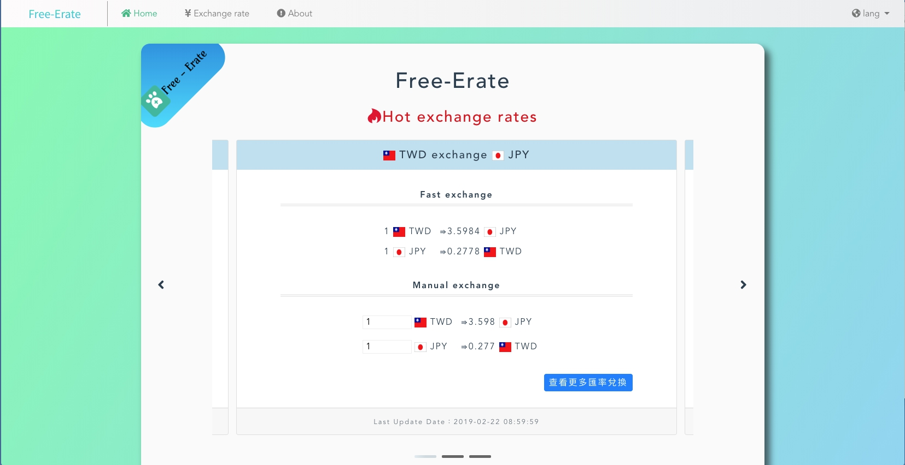
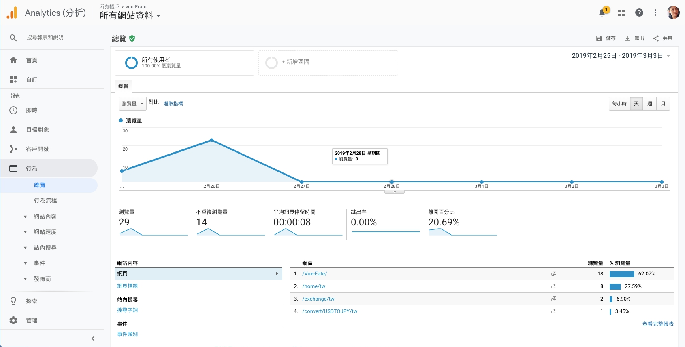
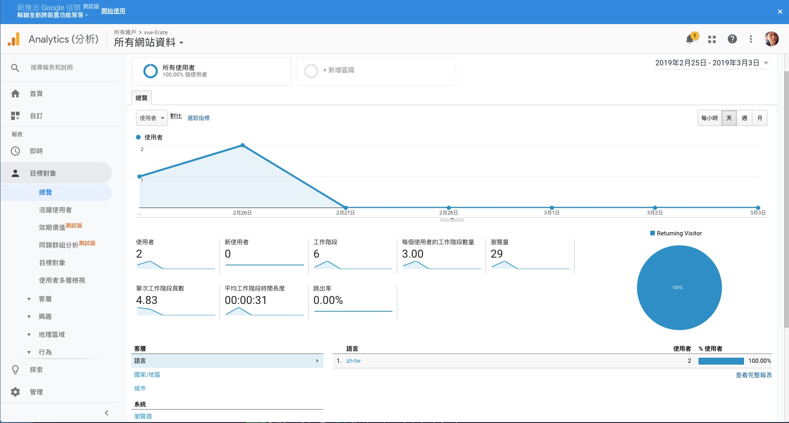

 # Vue-Eate
- <a href="https://joechen0730.github.io/Vue-Eate/" target="blank"><B>Vue-Eate</B> (RWD)</a>  
  <a href="https://joechen0730.github.io/Vue-Eate/" target="blank"> </a>  
- 使用 Vue cli3 ，並用 i18n 支持多語言（中 / 英) 。 
  <a href="https://joechen0730.github.io/Vue-Eate/" target="blank"> </a>   
  ⌞ 使用 MVVM 資料綁定的方式，可在下方表格輸入貨幣金額並且立馬轉換。 
  ⌞ 透過 node.js 線上資料庫每日抓取新 API資料  
  ⌞ 動態偵測網址切換後可直接更改語系(tw or en)  
  ⌞ 匯率兌換時，透過參數將值放置網址並且編碼傳送至兌換頁面，重整後解析一樣可得相同數值 
  ⌞ 使用 Google Analytics 來追蹤網站成效，並且設定轉換率確認使用者停留頁面等等事件 
    
    
  ⌞ 與<a href="https://github.com/Mix-Liten" target="blank"> Mix-Liten </a>好友透過 Git 共同完成。
